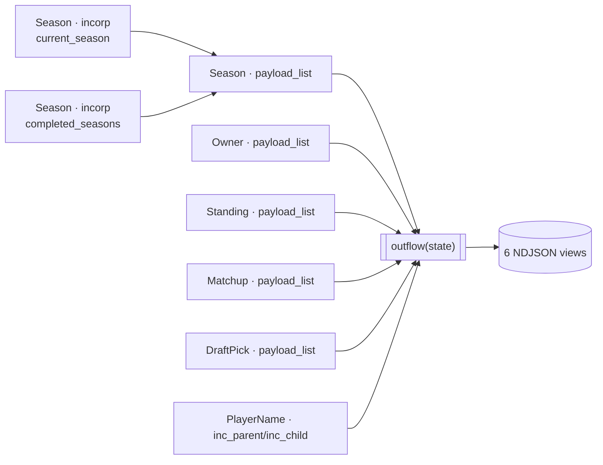

***

> 📎 **Appendix -- Multi-season one-shot fjord ETL.** Fetches every reachable
> season of an ESPN Fantasy Football league once and fuses standings,
> matchups, members, and drafts into six all-time views via a one-shot
> `Incorporator.fjord()` (no Watershed -- explained below). This appendix
> applies [Tutorial 9 -- NASCAR Fantasy Fjord](../../09-nascar-fantasy-fjord/README.md)'s
> one-shot shape to an auth-gated, multi-season pull -- read T9 first if
> you haven't. Two wrinkles vs. T9: `payload_list=` in-memory seeding for
> five of the six sources, and pre-declared (bare) view classes read back
> post-loop instead of T9's fully dynamic ones. New to `payload_list=`
> itself? Read [Tutorial 5](../../05-parent-child-drilling/README.md) first.

***

# 🏈 ESPN Fantasy Football League History: Six-View Franchise Almanac

Your league has been running on ESPN for years. Its history sits behind one
API call per season, and the Fantasy Football web app itself has no
all-time view -- no career win-loss log, no rivalry history, no franchise
records book. Port that by hand and it's one GET per season per view,
hand-joined in a spreadsheet every time someone asks "who has the most
titles?" This appendix fetches every reachable season once and fuses it
into six all-time views, from one run.

## 🎯 Goal



Two `Season.incorp` calls discover every reachable season; five of the six
fjord sources reuse that response via `payload_list=`; the sixth,
`PlayerName`, is the one genuinely-networked fan-out. `outflow(state)`
fuses all six into the export:

```
League 899513 -- public (no cookies)
Discovering reachable seasons via status.previousSeasons ...

Fetched 7 season(s): [2020, 2021, 2022, 2023, 2024, 2025, 2026]
  unresolved seasons (no data available): [2018, 2019]
Running one-shot fjord: Owner/Standing/Matchup/DraftPick network-free, PlayerName fanned out ...

Wrote 6 views to .../out:
  franchise_cards.ndjson    13 rows
  season_timeline.ndjson    72 rows
  rivalry_matrix.ndjson     75 rows
  records_book.ndjson       10 rows
  draft_tendencies.ndjson   54 rows
  settings_evolution.ndjson 7 rows

FRANCHISE CARDS (all-time, sorted by win%)
FRANCHISE               W-L-T          WIN%  SEASONS  TITLES  PLAYOFF%
----------------------------------------------------------------------
longhorn0010            53-29-0       0.646        6       1     83.3%
...
```

(`draft_tendencies.ndjson`'s row count drifts season to season as a season
enters or leaves the `first_overall` honor roll while its draft completes
-- the player-names section below covers the vacant-pick sentinel behind
that.)

## 🔑 Two auth modes, one pipeline

| Env var | Required? | Effect |
|---|---|---|
| `ESPN_LEAGUE_ID` | No -- defaults to `899513` | The league to fetch. `899513` is a third-party public demo league; swap in your own league's numeric ID (visible in the ESPN Fantasy web app URL: `.../football/league?leagueId=<ID>`). |
| `ESPN_S2` | No | Browser cookie value. Unlocks a private league plus the cookie-gated `leagueHistory` endpoint. |
| `ESPN_SWID` | No | Browser cookie value, paired with `ESPN_S2`. Both together enable private mode -- one alone still runs public mode. |

(Extracting these two cookie values from your browser is covered in
**Getting your cookies** below, right before Run it.)

## 📚 The six views

| View | File | Shape |
|---|---|---|
| Franchise Cards | `franchise_cards.ndjson` | Per owner, all-time: W-L-T, win%, PF/PA, seasons played (completed only), average finish, titles/runner-ups/last-places, playoff rate, `has_current_season`. |
| Season Timeline | `season_timeline.ndjson` | Per franchise-season: seed -> final rank, record, PF/PA, division, all-play expected wins, luck delta, `is_complete`. |
| Rivalry Matrix | `rivalry_matrix.ndjson` | Per franchise pair, all-time: meetings, W-L, playoff meetings, biggest blowout, closest game. |
| Records Book | `records_book.ndjson` | Ten all-time record kinds (below). |
| Draft Tendencies | `draft_tendencies.ndjson` | Three kinds: round-1 position mix, all-time most-drafted (top 15), first-overall honor roll. |
| Settings Evolution | `settings_evolution.ndjson` | Per season: league size, playoff format, PPR adoption, roster slots, division eras, `is_complete`. |

**The ten records-book kinds:** `highest_single_week_score`,
`lowest_single_week_score`, `largest_margin_of_victory`,
`narrowest_margin_of_victory`, `best_season_record`, `worst_season_record`,
`highest_season_points_for`, `lowest_season_points_for`,
`longest_win_streak`, `longest_loss_streak`. The six game-level kinds
filter to **decided** matchups first (`winner != "UNDECIDED"`): a playoff
bye (HOME-only, no `away` key) and an in-progress week (both sides `0.0`)
both stay `UNDECIDED` forever, so the filter runs on `winner`, not a
`totalPoints > 0` check. The other four kinds gate on completed season +
games-played>0 instead; streaks run chronological, spanning seasons.

> ⚠️ **Appending order decides `RecordRow.value`'s exported type.**
> `outflow(state)` appends the eight float-valued record kinds before the
> two streak kinds, so fjord's dynamic-schema inference locks `value`'s
> type from the first-sampled row and coerces the trailing int streak
> values to match -- `longest_win_streak` renders as `10.0`, not `10`.
> Move the streak entries to the front and the whole column flips instead.

### Completed vs. in-progress seasons

Every row from every season stays in every view, including the current,
still-in-progress year. `Season.is_complete`
(`status.finalScoringPeriod < status.latestScoringPeriod`) flags each
season, and only three season-counting `FranchiseCard` fields narrow their
denominator to completed seasons: `seasons_played`, `average_finish`, and
`playoff_rate`'s denominator -- a franchise whose only season is the
in-progress one reads `seasons_played: 0, average_finish: 0.0,
playoff_rate: 0.0` rather than dividing by zero. `has_current_season`
marks that franchise; `SeasonTimelineRow`/`SettingsRow.is_complete` carry
the flag downstream. Every other fold stays fully inclusive.

## 🔍 Season discovery: two `Season.incorp` calls

Season discovery reads ESPN's own `status.previousSeasons` field off the
current-year response -- two `Season.incorp` call sites, mode decided once
from cookie presence, as one argument ternary (`completed_kwargs`) feeding
a single fan-out call. **`current_season`** is one call for the
in-progress year (the modern endpoint). **History/fan-out** is one call,
one statement: with cookies, one `Season.incorp(inc_url=<leagueHistory
URL>)` against the cookie-gated `leagueHistory/{league_id}` endpoint,
whose response IS the list of every other completed season; with no
cookies, a declarative `inc_parent=current_season,
inc_child="previous_seasons"` drill fans the modern per-season endpoint
out instead, the same shape as
[Tutorial 6](../../06-state-sports/README.md)'s per-team drill.

> ⚠️ **`leagueHistory` 401s without cookies.** That's the entire reason two
> modes exist: the cookie-gated endpoint 401s the instant `ESPN_S2` /
> `ESPN_SWID` are absent, so the public branch drills the modern
> per-season endpoint instead. Set only one of the two cookie env vars and
> you still get the public branch's fan-out, not a partial-auth error.

League size reads from each season's own `len(season.teams)`, since team
counts drift across seasons. A modern-endpoint miss on an old season lands
that year's URL in `.failed_sources` / `.rejects` plus a WARNING log line.
Both `Season.incorp` calls, and later `PlayerName`'s fan-out, hit the same
host, throttled via `register_host_penstock(
"lm-api-reads.fantasy.espn.com", rate_per_sec=1.0)` (capability table
below) -- ESPN's fantasy-read API publishes no rate limit of its own.

## 🌊 Why a one-shot fjord, not a Watershed

Every season is fetched exactly once, ever -- there's no polling axis, and
a Watershed's value is repeated ticks against a moving window. Give every
`stream_params` entry `refresh_params=None`, omit `export_interval`, and
`fjord()` seeds every source once, flushes `outflow(state)` once, and
exits -- T9 is the shipped precedent.

Every `Incorporator` subclass here -- sources and derived views alike --
lives in one sidecar, [`outflow.py`](outflow.py), loaded via
`load_outflow_module(...)` so the console report's post-loop `.inc_dict`
reads resolve against the same class objects `fjord()` built. The six
views are plain Python inside `outflow(state)`: one pass over
`state["Matchup"]` builds shared structures that Franchise Cards, the
rivalry matrix, and six of the ten records-book kinds bucket or
`max()`/`min()` over; the other four read `standings`/`played_seasons`
directly instead.

## 🔗 `payload_list=` and read-time joins

Every sub-collection (`teams`, `schedule`, `members`, `draftDetail.picks`)
is pulled off every fetched `Season` row and flattened into one list, then
handed to a sibling fjord source's `payload_list=` -- a network-free,
in-memory passthrough seeded once per class rather than once per season.
Each row is an explicit dict literal built by attribute access: **Owner**
rows are 2 keys; **Standing** rows are 12; **Matchup** rows flatten
`home`/`away` to scalar `home_points`/`away_points`, preserving the
playoff-bye tri-state (`away_points` is `None` for a bye, `0.0` for a
scoreless-but-played game); **DraftPick** rows are 5 keys.

A bare ESPN `team.id` repeats every season, so `Standing`'s own `conv_dict`
synthesizes a `"{season}:{id}"` composite key inline
(`calc("{}:{}".format, "season", "id", target_type=str)`,
`inc_code="team_key"`), and `main()`'s pre-fjord Python builds the
identical composite as an f-string to thread each team's owner GUID onto
its sibling schedule/pick rows before `Matchup`/`DraftPick` ever seed. The
one join that can't move upstream -- an owner GUID resolved to
`Owner.display_name` -- stays read-time (`.inc_dict.get(...)`) instead,
since `Owner` is a sibling fjord source with no seeding-order guarantee.

> 💡 **A bare class keeps every field -- one field opts out on purpose.**
> Since the flush() bare-class inference fix, a bare view class like
> `class FranchiseCard(Incorporator): pass` keeps every field
> `outflow(state)` returns, landing in `FranchiseCard.inc_dict` for the
> console report to read back -- all six view classes here are bare for
> that reason. `Season.roster_slots` opts out on purpose instead: declaring
> a field on an otherwise-bare class exempts just that field. Stub
> `roster_slots: dict[str, int] | None = None` (as `Season` does) and its
> digit-string keys survive untouched; leave it undeclared and the
> auto-promoted submodel mangles them into `field_0`, `field_2`, ... instead.

## 🧑‍🤝‍🧑 Player names: one shared fan-out, not two passes

Draft picks carry only a numeric `playerId` (negative for D/ST, e.g.
`-16003` for a Bears defense) -- resolving a name needs a season-matched
call to ESPN's `players_wl` endpoint, since old IDs don't resolve against a
newer season's player universe. The pipeline makes exactly one
`PlayerName.incorp` call, a declarative `inc_parent=all_seasons,
inc_child="season"` drill (the same shape as
[Tutorial 6](../../06-state-sports/README.md)) fanning out over every
season's `players_wl` URL concurrently, sharing one `X-Fantasy-Filter`
header whose value is the union of every wanted id -- round-1 picks from
every season, plus the all-time top-15 most-drafted `playerId`s, computed
once via a `collections.Counter` pass over every fetched pick. Each season
endpoint resolves only the ids it recognises out of that shared union;
`inc_code="id"` dedups the rest into one `PlayerName.inc_dict`.
`DraftPick.player` resolves as a read-time join in `outflow(state)`
(`player_names.inc_dict.get(p.playerId)`), since the two are sibling fjord
sources with no ordering guarantee between them.

`defaultPositionId` (not `lineupSlotId`) is the verified position source --
`1=QB`, `2=RB`, `3=WR`, `4=TE`, `5=K`, `16=D/ST` -- an unmapped id falling
back to `POS_<id>` rather than crashing. ESPN's own vacant/placeholder-pick
sentinel (`playerId == -1`, an undrafted or not-yet-reached slot ESPN
returns fully formed) is filtered out of `main()`'s `all_pick_rows` flatten
before it ever becomes a `DraftPick` row -- it never reaches the
`"Unknown"` fallback other unresolved lookups use.

## 💻 The one-shot fjord call

Abridged from [`espn_league_history.py`](espn_league_history.py) (`# ...`
marks elided entries):

```python
async for wave in Incorporator.fjord(
    stream_params=[
        # ... Season, Owner, Standing, Matchup, and DraftPick: one entry each,
        # "payload_list": <flattened rows>, "refresh_params": None
        {
            "cls": PlayerName,
            "incorp_params": {
                "inc_parent": all_seasons,
                "inc_child": "season",
                "inc_url": f"{BASE}/seasons/{{}}/players",
                # wanted_ids is the union across all seasons, sent as one shared header so
                # every season's players resolve in a single inc_parent/inc_child call.
                "headers": {**auth_headers, "X-Fantasy-Filter": json.dumps({"filterIds": {"value": wanted_ids}})},
                "params": {"view": "players_wl"},
                "inc_code": "id",
                "inc_name": "fullName",
                "conv_dict": {
                    "position": calc(position_name, "defaultPositionId", default="UNKNOWN", target_type=str)
                },
            },
            "refresh_params": None,
        },
    ],
    outflow=_outflow_path,
    export_params={
        "FranchiseCard": {"file_path": str(out_dir / "franchise_cards.ndjson")},
        # ... one {"file_path": ...} entry per remaining view
    },
):
```

## 📄 Sample output

`FranchiseCard`'s real fields for the top-ranked franchise from the console
report above (fields not printed to console are elided, not guessed):

```jsonc
{
  "display_name": "longhorn0010",
  "wins": 53, "losses": 29, "ties": 0,
  "win_pct": 0.646,
  "seasons_played": 6,
  "championships": 1,
  "playoff_rate": 0.833
  // owner_guid, points_for, points_against, average_finish, runner_ups,
  // last_places, playoff_appearances, has_current_season -- see the
  // Franchise Cards row in the views table above for the full shape
}
```

A second or third view's per-row sample is skipped: the console report
above prints only the Franchise Cards table, so a genuine
`SeasonTimelineRow` / `RivalryRow` sample would need a live run or invented
numbers -- the Views table above already gives each one's field shape.

## 🧠 What this appendix demonstrates

| Capability | How |
|---|---|
| `payload_list=` in-memory seeding (T9 has zero) | Five of the six fjord sources (`Season`, `Owner`, `Standing`, `Matchup`, `DraftPick`) skip the network entirely -- each is fed from the same season response `main()` already fetched. |
| Bare view classes read post-loop + one declared field | All six derived view classes stay bare so their built rows land in `.inc_dict` for the console report; `Season.roster_slots` is the one declared field in the file -- the documented exception to "pre-declaring suppresses inference." |
| Two-mode auth from one call site | `completed_kwargs`, an argument ternary on cookie presence, feeds the single `Season.incorp(..., **completed_kwargs)` call -- one call site, not two code paths. |
| `inc_parent`/`inc_child` in Python-object form, twice | The public-mode season fan-out and `PlayerName`'s season fan-out both drill declaratively -- the same shape Tutorial 6 uses for its per-team drill. |
| One shared `X-Fantasy-Filter` union header | `PlayerName`'s single `incorp()` call sends one header built as the union of every wanted `playerId` across every season, instead of a per-pick lookup. |
| `is_complete` status-field pattern | `Season.is_complete` gates only the three season-counting `FranchiseCard` fields; every game-level fold stays fully inclusive of the in-progress season. |
| One-shot `refresh_params=None`, no `export_interval` | Every `stream_params` entry opts out of the daemon's refresh loop, so `fjord()` seeds once, flushes once, and exits. |
| `register_host_penstock` | `register_host_penstock("lm-api-reads.fantasy.espn.com", rate_per_sec=1.0)` -- ESPN's fantasy-read API is unauthenticated and publishes no rate limit of its own. |

## 🔐 Getting your cookies

Only needed for a private league or the cookie-gated `leagueHistory`
endpoint. Chrome/Edge DevTools: log into
[fantasy.espn.com](https://fantasy.espn.com), open your league, then
DevTools (F12) -> **Application** -> **Cookies** -> `https://fantasy.espn.com`.
Copy `espn_s2` and `SWID` (a brace-wrapped GUID) into `ESPN_S2` / `ESPN_SWID`.

Demo league `899513`'s own floor is season 2020 -- 2018/2019 exist per
`status.previousSeasons` but 401 without cookies, landing in the
`unresolved seasons` line of the console report above.

## 🏁 Run it

```bash
# Public demo league, no setup required
python examples/appendix/espn-league-history/espn_league_history.py

# Your own league, or a private one
ESPN_LEAGUE_ID=1234567 ESPN_S2=... ESPN_SWID='{...}' \
  python examples/appendix/espn-league-history/espn_league_history.py
```

Also runs in Docker via the
[central mount pattern](../../README.md#running-a-tutorial-in-docker) --
pass the three env vars through with `-e`.

## Where to Go Next

| Goal | Read |
|---|---|
| The one-shot `fjord()` shape this appendix follows | [Tutorial 9 -- NASCAR Fantasy Fjord](../../09-nascar-fantasy-fjord/README.md) |
| A plain one-shot script, no fjord, no Watershed | [Tutorial 6 -- State Sports](../../06-state-sports/README.md) |
| Build rows from data already in memory | [Tutorial 5 -- Parent-Child Drilling](../../05-parent-child-drilling/README.md) |
| Universal export formats (`Cls.export(...)`) | [Tutorial 3 -- Universal Formats](../../03-universal-formats/README.md) |
| A read-time multi-source join, as a Tideweaver Fjord current instead | [`crypto-graph-mapping`](../crypto-graph-mapping/README.md) |

***

**Have a suggestion or hitting a snag?**
[Edit this page on GitHub](https://github.com/PyPlumber/incorporator/edit/main/examples/appendix/espn-league-history/README.md) ·
[Report an issue](https://github.com/PyPlumber/incorporator/issues/new/choose) ·
[Browse open issues](https://github.com/PyPlumber/incorporator/issues)
